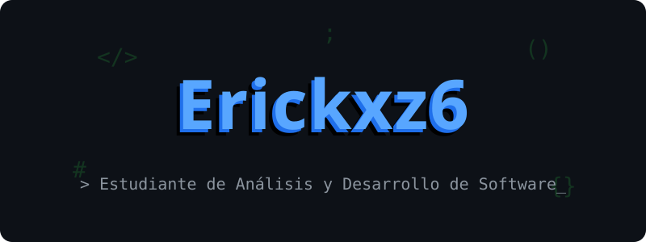
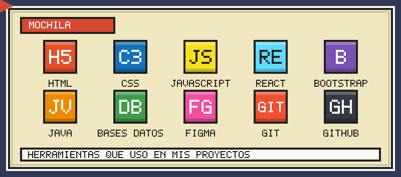

  

 

## 👨‍💻 Sobre mí

- 🎓 Tecnólogo en formación en **Análisis y Desarrollo de Software** en el SENA.
- 🌐 Me enfoco en el **desarrollo web**: me gusta crear interfaces claras y funcionales.
- 🎨 Diseño prototipos en **Figma** antes de llevarlos a código.
- 🗣️ Inglés nivel **A2**, mejorando cada día.
- 📍 Arjona, Bolívar, Colombia.

 

## 🎒 Mi mochila de herramientas

| Área | Herramientas |
|------|--------------|
| 🌐 **Desarrollo web** | HTML5 · CSS3 · JavaScript · React · Bootstrap |
| ⚙️ **Programación** | Java |
| 🗄️ **Datos** | Bases de datos |
| 🎨 **Diseño** | Figma |
| 🔧 **Control de versiones y despliegue** | Git · GitHub · GitHub Pages |

 

## 🚀 Proyectos destacados

<table>
  <tr>
    <td width="50%" valign="top">
      <h3>🧢 Maison Merch</h3>
      
Tienda en línea de gorras con catálogo filtrable por categorías, carrito de compras, promociones y formulario de suscripción con validación.

      

        
        
        
      

      <a href="https://erickxz6.github.io/MaisonMerch/">🔗 Ver demo</a>
    </td>
    <td width="50%" valign="top">
      <h3>🎮 PlayEnglish</h3>
      
Plataforma web para aprender inglés jugando: niveles A1–C2, ejercicios, sistema de XP y rachas, diccionario, comunidad y modo claro/oscuro.

      

        
        
        
      

      <a href="https://erickxz6.github.io/english-learning/#landing">🔗 Ver demo</a>
    </td>
  </tr>
</table>

 

## 📊 Estadísticas de GitHub

  
  

 

## 📫 Contacto

